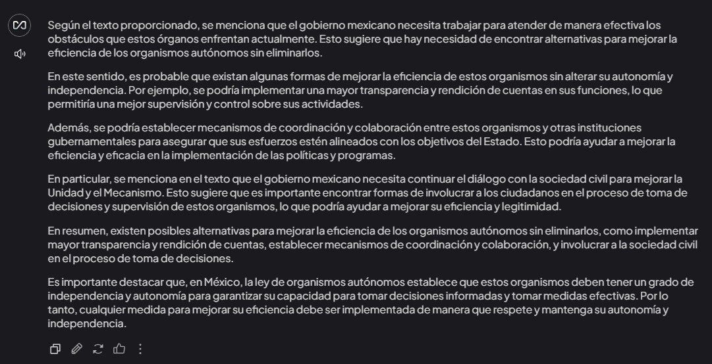

# Actividad 4

## Fundamentación sobre la Reforma al Poder Judicial y Organismos Autónomos

Utilizando algoritmos de inteligencia artificial, responder las siguientes preguntas y fundamentar si estás a favor o en contra de la reforma al poder judicial y a los organismos autónomos.

### Preguntas para la Ley del Poder Judicial

## 1. **¿El diagnóstico de la ley al poder judicial es conocido y qué estudios expertos se tuvieron en cuenta?**

### Respuesta Inicial
Ollama señala que el diagnóstico de la ley sobre el poder judicial pone en riesgo la independencia, la imparcialidad y la autonomía del Poder Judicial. Sin embargo, no se especifica quiénes fueron los expertos o estudios considerados para fundamentar este diagnóstico. Además, se destaca que diversas instituciones y organizaciones han emitido críticas hacia la reforma debido a su falta de transparencia y participación ciudadana.

**Postura de Ollama:** Subraya la ausencia de información explícita sobre los estudios o expertos consultados, destacando la importancia de un diagnóstico basado en análisis objetivos y rigurosos para garantizar la efectividad de la reforma.

### Análisis Detallado

#### A) **Importancia de un Diagnóstico Fundado**
1. **Bases del Diagnóstico**:
   - Un diagnóstico sólido debe fundamentarse en estudios realizados por expertos en derecho, política y administración pública.
   - La participación de instituciones académicas y organismos internacionales puede aportar perspectivas objetivas y variadas.

2. **Impacto de la Falta de Transparencia**:
   - La ausencia de información sobre los estudios considerados genera incertidumbre sobre la validez del diagnóstico.
   - La percepción pública puede verse afectada, interpretando esta omisión como falta de rigor en el proceso.

#### B) **Posibles Fuentes del Diagnóstico**
1. **Instituciones Nacionales**:
   - Organismos como el Instituto Nacional de Transparencia y Acceso a la Información (INAI) o la Comisión Nacional de los Derechos Humanos (CNDH) podrían haber sido consultados.

2. **Organismos Internacionales**:
   - Instituciones como la Organización de los Estados Americanos (OEA) y otros actores relevantes en derechos humanos y justicia han emitido observaciones sobre la reforma.

#### C) **Críticas y Cuestionamientos**
1. **Límites del Diagnóstico**:
   - La falta de participación de expertos independientes y ciudadanos puede limitar la profundidad del análisis.

2. **Consecuencias en la Reforma**:
   - Sin un diagnóstico ampliamente validado, las medidas implementadas podrían carecer de efectividad o aceptación.

### Propuestas para Mejorar el Diagnóstico
1. **Transparencia en la Metodología**:
   - Publicar los estudios y análisis utilizados como base para el diagnóstico.

2. **Participación Multisectorial**:
   - Incorporar a expertos académicos, organizaciones civiles y organismos internacionales en el proceso de evaluación.

3. **Revisión y Actualización Periódica**:
   - Establecer mecanismos para revisar y ajustar el diagnóstico conforme surjan nuevos desafíos y datos.

### Conclusión
El diagnóstico de la reforma judicial es un elemento crítico que requiere mayor transparencia y participación para garantizar su efectividad y legitimidad. Incorporar estudios sólidos y consultar a expertos diversificados fortalecería las bases de la reforma y aumentaría la confianza pública.

Respuesta de Ollama

## 2. **¿Por qué la reforma no incluyó a las fiscalías y a la defensoría, limitándose solo al poder judicial?**

### Respuesta Inicial
Ollama señala que la omisión de las fiscalías y la Defensoría del Pueblo en la reforma judicial sugiere una preferencia por priorizar un sector específico, en este caso, el Poder Judicial, sobre otras instituciones fundamentales para la justicia y la protección de los derechos humanos. Además, destaca que esta decisión podría reflejar un interés gubernamental en fortalecer ciertas áreas a expensas de otras.

**Postura de Ollama:** No adopta una posición explícita a favor o en contra de la reforma, pero subraya que la exclusión de estas instituciones representa un vacío significativo en el alcance de la reforma y podría erosionar la independencia y autonomía de las fiscalías y la Defensoría.

### Análisis Detallado

#### A) **Impacto de la Exclusión**
1. **En las Fiscalías**:
   - Las fiscalías desempeñan un rol esencial en la investigación y procesamiento de delitos.
   - Su exclusión podría debilitar el combate a la corrupción y la criminalidad organizada.

2. **En la Defensoría del Pueblo**:
   - La Defensoría protege los derechos humanos y actúa como intermediaria entre los ciudadanos y el gobierno.
   - La falta de reformas en esta área limita su capacidad de actuar eficazmente frente a abusos de poder.

#### B) **Motivaciones Potenciales**
1. **Prioridad Gubernamental**:
   - La reforma parece enfocarse en el Poder Judicial para garantizar su independencia, posiblemente debido a preocupaciones inmediatas sobre su imparcialidad.

2. **Desafíos Logísticos y Políticos**:
   - Incluir a las fiscalías y la Defensoría habría requerido un debate más amplio y posiblemente enfrentado mayor resistencia política.

#### C) **Consecuencias de la Omisión**
1. **Debilitamiento Institucional**:
   - La falta de reformas en las fiscalías y la Defensoría perpetúa problemas estructurales como la ineficacia y la falta de recursos.

2. **Percepción Pública**:
   - La omisión puede ser interpretada como una falta de compromiso con una reforma integral del sistema de justicia.

### Propuestas para Enmendar la Omisión
1. **Reformas Complementarias**:
   - Incluir reformas específicas para fortalecer las fiscalías y la Defensoría en futuros procesos legislativos.

2. **Colaboración Interinstitucional**:
   - Establecer mecanismos de cooperación entre el Poder Judicial, las fiscalías y la Defensoría para garantizar un sistema de justicia cohesivo.

3. **Fortalecimiento de la Transparencia**:
   - Implementar medidas para asegurar que estas instituciones operen de manera independiente y transparente.

### Conclusión
La exclusión de las fiscalías y la Defensoría del Pueblo en la reforma judicial es un punto crítico que debe ser abordado en el futuro para garantizar un sistema de justicia integral y efectivo. 

Respuesta Ollama: 

## 3. **¿Qué medidas concretas se implementarán para evitar la captación del crimen organizado y la violencia en el contexto electoral?**

### Respuesta Inicial
Ollama indica que la reforma del Poder Judicial no incluye medidas concretas para enfrentar la captación del crimen organizado ni la violencia en el contexto electoral. Sin embargo, enfatiza la necesidad de un enfoque integral para abordar estos problemas estructurales.

**Postura de Ollama:** Ollama no adopta una posición directa a favor o en contra de las medidas propuestas, pero subraya que la reforma actual carece de mecanismos específicos para resolver estos desafíos y que un enfoque más integral es necesario.

### Análisis Detallado

#### A) **Problemática Principal**
1. **Influencia del Crimen Organizado**:
   - Intimidación y manipulación de candidatos por parte de grupos delictivos.
   - Financiamiento ilícito de campañas electorales para asegurar influencia política.

2. **Violencia en el Contexto Electoral**:
   - Ataques físicos contra candidatos, funcionarios y sus familias.
   - Amenazas y asesinatos de actores políticos y judiciales.

3. **Falta de Regulación Efectiva**:
   - Carencia de sistemas sólidos para monitorear y prevenir la infiltración criminal.
   - Debilidades en la implementación de políticas de seguridad electoral.

#### B) **Propuestas Clave para Mitigar Riesgos**
1. **Fortalecimiento de la Transparencia Electoral**:
   - Auditorías estrictas de financiamiento de campañas.
   - Publicación de informes financieros en plataformas accesibles al público.

2. **Protección de Candidatos y Funcionarios**:
   - Programas de seguridad especializados para proteger a candidatos en zonas de alto riesgo.
   - Creación de unidades especiales para investigar y sancionar actos de violencia electoral.

3. **Colaboración Interinstitucional**:
   - Coordinación entre las fuerzas de seguridad, el sistema judicial y las autoridades electorales.
   - Inclusión de organismos internacionales para supervisar procesos clave.

4. **Educación y Concientización**:
   - Campañas de sensibilización sobre los riesgos de la influencia criminal en la democracia.
   - Programas de capacitación para candidatos y funcionarios sobre seguridad personal.

#### C) **Reformas Estructurales Necesarias**
1. **Mejoras en el Marco Legal**:
   - Endurecimiento de sanciones para delitos relacionados con la violencia electoral.
   - Revisión y fortalecimiento de las leyes de financiamiento de campañas.

2. **Tecnología y Monitoreo**:
   - Implementación de sistemas de monitoreo basados en inteligencia artificial para detectar patrones de financiamiento ilícito.
   - Uso de tecnologías para rastrear movimientos sospechosos durante las campañas.

3. **Fomento de la Independencia Institucional**:
   - Asegurar que las instituciones electorales y judiciales operen sin influencia política o criminal.
   - Protección de los funcionarios responsables de implementar estas medidas.

### Conclusión
Para evitar la captación del crimen organizado y la violencia en el contexto electoral, es esencial:
1. **Fortalecer la Seguridad y la Transparencia**: Implementar medidas concretas para proteger a candidatos y funcionarios.
2. **Establecer Colaboración Interinstitucional**: Garantizar un enfoque integral que incluya a diversas entidades gubernamentales e internacionales.
3. **Promover Reformas Legales y Estructurales**: Fortalecer el marco legal y el uso de tecnología para prevenir la influencia criminal.

Respuesta de Ollama: 

## 4. **¿Cómo garantizar que juristas probos y honestos se animen a competir públicamente frente a los riesgos de la violencia?**

### Respuesta Inicial
Ollama señala que garantizar la participación de juristas probos y honestos requiere enfrentar el problema de la violencia e intimidación en México. Propone medidas de protección, sistemas de denuncia y fondos de indemnización para mitigar los riesgos.

**Postura de Ollama:** Ollama está a favor de establecer medidas concretas que protejan a los juristas de la violencia e intimidación, para fomentar su participación en procesos judiciales.

### Análisis Detallado

#### A) **Problemas en la Participación de Juristas**
1. **Amenazas a la Seguridad Física**:
   - La violencia contra miembros del Poder Judicial disuade la participación de profesionales honestos.
   - Casos documentados de ataques y represalias contra jueces y fiscales en México.

2. **Falta de Protección Efectiva**:
   - Ausencia de programas robustos de protección para juristas y sus familias.
   - Limitaciones en la respuesta de las autoridades frente a amenazas directas.

3. **Percepción de Impunidad**:
   - Baja tasa de resolución de crímenes contra figuras judiciales.
   - Sensación de desamparo entre los profesionales del derecho.

#### B) **Principios para Mitigar los Riesgos**
1. **Seguridad y Protección**:
   - Creación de protocolos de seguridad especializados para juristas.
   - Acceso a recursos para implementar medidas preventivas y reactivas.

2. **Respaldo Institucional**:
   - Compromiso del Estado para proteger a los operadores del sistema judicial.
   - Establecimiento de fondos de emergencia para apoyar a víctimas de violencia.

3. **Fomento de la Confianza Pública**:
   - Implementación de campañas que destaquen la importancia del trabajo judicial.
   - Asegurar que los casos de violencia sean investigados y sancionados.

#### C) **Estrategias para Fomentar la Participación de Juristas**
1. **Programas de Protección y Acompañamiento**:
   - Creación de unidades especializadas para proteger a juristas y sus familias.
   - Colaboración con organismos internacionales para implementar mejores prácticas.

2. **Mecanismos de Denuncia y Apoyo**:
   - Desarrollo de canales anónimos y seguros para reportar amenazas.
   - Provisión de asistencia psicológica y legal para juristas afectados.

3. **Reformas Estructurales**:
   - Fortalecer la independencia judicial para reducir presiones externas.
   - Promover la profesionalización y capacitación continua de los juristas.

### Conclusión
Garantizar que juristas probos y honestos participen activamente en el sistema judicial requiere:
1. **Implementar Medidas de Seguridad**: Proveer protección robusta y recursos adecuados para enfrentar la violencia.
2. **Fortalecer la Confianza Pública**: Asegurar que los operadores judiciales cuenten con respaldo institucional.
3. **Promover un Ambiente de Justicia**: Fomentar la participación mediante incentivos y medidas preventivas.

Respuesta de Ollama: 

## 5. **¿Cómo se conforman los comités de postulación?**

### Respuesta Inicial
Ollama afirma que la conformación de los comités de postulación debe ser transparente y equitativa, garantizando procesos justos y libres de influencias externas. Además, resalta la importancia de seguir las normas establecidas en la Constitución y la Ley del Poder Judicial para mantener la independencia y la imparcialidad del sistema.

**Postura de Ollama:** Ollama está a favor de una reforma que priorice la representación equitativa, la transparencia y la neutralidad en la conformación de los comités de postulación. Su postura enfatiza que este enfoque es esencial para fortalecer la independencia judicial.

### Análisis Detallado

#### A) **Problemas en la Conformación de Comités de Postulación**
1. **Falta de Representación Diversa**:
   - Riesgos de sesgos en los procesos si los comités carecen de diversidad de perspectivas.
   - Exclusión de actores clave como la academia, sociedad civil y expertos independientes.

2. **Opacidad en los Procesos**:
   - Ausencia de mecanismos claros para la selección de miembros.
   - Percepción de manipulación o favoritismo en la integración de los comités.

3. **Influencia Política**:
   - Posibilidad de injerencias externas que comprometan la independencia del proceso.
   - Designaciones basadas en intereses partidistas más que en méritos objetivos.

#### B) **Principios para una Conformación Adecuada**
1. **Representación Equitativa**:
   - Inclusión de actores diversos: académicos, juristas, sociedad civil y operadores judiciales.
   - Asegurar paridad de género y representación de minorías.

2. **Transparencia y Publicidad**:
   - Publicación de criterios y procedimientos para la selección de miembros.
   - Transmisión en vivo de las sesiones de deliberación para garantizar la confianza pública.

3. **Neutralidad y Mérito**:
   - Selección de miembros con base en méritos objetivos y experiencia jurídica.
   - Establecimiento de lineamientos que eviten conflictos de interés.

#### C) **Estrategias para Implementar Comités Sólidos**
1. **Legislación Clara y Vinculante**:
   - Reformas legales que regulen la composición y funcionamiento de los comités.
   - Alineación con estándares internacionales, como los principios de Bangalore sobre conducta judicial.

2. **Supervisión por Organismos Independientes**:
   - Creación de auditorías externas para garantizar la legalidad de los procesos.
   - Involucrar observadores nacionales e internacionales.

3. **Uso de Tecnología**:
   - Implementación de plataformas digitales para la recepción y evaluación de candidatos.
   - Publicación de avances y resultados en tiempo real.

### Conclusión
Para conformar comités de postulación efectivos, es crucial:
1. **Garantizar Diversidad y Representación Equitativa**: Incluir actores clave que reflejen las necesidades y perspectivas de la sociedad.
2. **Priorizar la Transparencia**: Implementar mecanismos públicos y verificables para generar confianza.
3. **Asegurar la Neutralidad**: Evitar influencias externas y asegurar decisiones basadas en mérito y competencia.

Respuesta de ollama:

## 6. **¿Cómo asegurar la carrera judicial?**

### Respuesta Inicial
Ollama afirma que “la elección popular de jueces no es el camino” para asegurar la independencia del Poder Judicial, señalando que este enfoque podría conducir a decisiones basadas en factores políticos más que en méritos jurídicos. La carrera judicial debe ser garantizada mediante procesos de selección transparentes y objetivos que prioricen las competencias legales.

**Postura de Ollama:** Ollama está en contra de la elección popular de jueces. Su postura defiende un enfoque basado en evaluaciones técnicas, argumentando que este método preserva la independencia judicial y asegura un sistema más imparcial.

### Análisis Detallado

#### A) **Problemas de la Elección Popular de Jueces**
1. **Politización del Proceso**:
   - La elección popular puede priorizar popularidad sobre capacidad jurídica.
   - Existen riesgos de influencias partidistas que comprometan la independencia judicial.

2. **Falta de Evaluación Técnica**:
   - Los ciudadanos podrían no contar con la información adecuada para evaluar competencias técnicas.
   - La elección popular no garantiza la objetividad en la selección de jueces.

#### B) **Principios para Asegurar la Carrera Judicial**
1. **Transparencia y Mérito**:
   - Procesos de selección basados en evaluaciones objetivas y estandarizadas.
   - Publicación de los criterios de evaluación y resultados.

2. **Formación Continua**:
   - Institución de programas de capacitación obligatoria para jueces.
   - Establecimiento de institutos especializados que fortalezcan el desarrollo profesional.

3. **Mecanismos de Supervisión y Evaluación**:
   - Creación de comités independientes para evaluar el desempeño de los jueces.
   - Revisión periódica basada en estándares internacionales.

#### C) **Enfoque Basado en Diálogo y Consenso Nacional**
1. **Participación Multisectorial**:
   - Involucrar a expertos, academia, sociedad civil y órganos judiciales en el diseño de reformas.
   - Promover un diálogo sincero entre todas las partes interesadas.

2. **Legislación Alineada con Estándares Internacionales**:
   - Adoptar principios de independencia judicial establecidos por la ONU y la OEA.
   - Asegurar la imparcialidad mediante mecanismos legales sólidos.

### Conclusión
Para garantizar una carrera judicial sólida, es crucial:
1. **Evitar la Elección Popular**: Sustituir este enfoque con procesos basados en mérito y transparencia.
2. **Fortalecer la Capacitación**: Establecer programas formativos continuos para jueces.
3. **Implementar Supervisión Rigurosa**: Garantizar la independencia mediante evaluaciones periódicas y comités externos.

Respuesta de ollama: 

## 7. **¿Cómo compatibilizar la incorporación de medidas para preservar la identidad de los jueces (conocidos en el sistema interamericano como "jueces sin rostro") con los estándares internacionales?**

Respuesta Inicial

La implementación de medidas que garanticen el anonimato de los jueces es una práctica que puede fortalecer su seguridad personal y profesional, especialmente en contextos donde enfrentan amenazas. Sin embargo, estas medidas deben ser compatibles con los estándares internacionales, que priorizan la transparencia, imparcialidad y el debido proceso.

**Postura de Ollama:** Ollama se muestra a favor de estas medidas bajo ciertas condiciones. Argumenta que, aunque el anonimato puede ser esencial para proteger la vida de los jueces en contextos de riesgo, su implementación debe equilibrarse cuidadosamente con los principios de transparencia y derechos procesales.

Análisis Detallado

A) Necesidad de Medidas de Protección

1. Riesgos para la Seguridad de los Jueces:

- Contextos de violencia y amenazas en México justifican la necesidad de anonimato.
- Precedentes internacionales como Colombia muestran que "jueces sin rostro" pueden ser una herramienta eficaz para proteger la independencia judicial.

2. Implicaciones para la Imparcialidad y Confianza Ciudadana:

- El anonimato podría generar dudas sobre la imparcialidad de los jueces.
- La falta de identificación visible podría ser percibida como falta de transparencia.

B) Estándares Internacionales Aplicables

1. Principios del Sistema Interamericano de Derechos Humanos:

- Debido Proceso: Toda persona tiene derecho a conocer la identidad del juez que decide sobre su caso.
- Independencia Judicial: Las medidas de anonimato no deben comprometer la percepción de imparcialidad.

Recomendaciones de Naciones Unidas:

- Las medidas deben ser excepcionales y proporcionales al nivel de riesgo.
- Deben existir mecanismos de supervisión que garanticen su uso adecuado.

C) Compatibilización de Medidas con Estándares Internacionales

1. Diseño de Protocolos Específicos:

- Determinar criterios claros para aplicar el anonimato, considerando el nivel de riesgo.
-Capacitar a los jueces y al personal judicial sobre el manejo adecuado de estas medidas.

2. Transparencia Institucional:

- Informar a la opinión pública sobre las razones y objetivos de estas medidas.
- Establecer auditorías externas para monitorear su implementación.

3. Compatibilidad Tecnológica y Legal:

- Implementar sistemas seguros de gestión de identidad que protejan la información sensible.
- Garantizar que las leyes nacionales estén alineadas con tratados internacionales de derechos humanos.

Conclusión

Compatibilizar "jueces sin rostro" con los estándares internacionales requiere un enfoque balanceado que considere:

- Seguridad vs Transparencia: Priorizar la seguridad sin comprometer el debido proceso.
- Supervisión y Control: Establecer auditorías independientes.
- Adecuación Normativa: Reformar leyes para garantizar conformidad con tratados internacionales.

Respuesta de Ollama:

## 8. **¿Cómo impactará el costo económico de esta reforma en la promoción y el acceso a la justicia?**

Respuesta Inicial

La reforma judicial propuesta, centrada en la elección popular de jueces, puede generar un impacto significativo en el costo económico y en la promoción y acceso a la justicia. Los puntos clave incluyen:

- Incremento de Costos: Requerimientos como capacitación de jueces, sistemas de evaluación, y nueva infraestructura.

- Percepción Económica Internacional: Preocupaciones de inversores internacionales, incluyendo recomendaciones de Morgan Stanley de reducir participación en empresas mexicanas.

- Efectividad Judicial: La promoción de justicia también depende de la calidad e independencia del sistema judicial.

Análisis Detallado

A) Impacto en el Costo Económico

La reforma requerirá una inversión significativa en:

- Capacitación de Jueces: Institutos especializados podrían costar millones de pesos anuales.
- Infraestructura Adicional: Nuevas oficinas y tecnologías judiciales.
- Sistemas de Evaluación: Monitoreo constante del desempeño judicial.

Estas inversiones podrían derivar en:

- Afectación al Presupuesto Nacional: Desviación de recursos de áreas como salud y educación.
- Incremento de la Prima de Riesgo: Inversores perciben mayor incertidumbre, lo que encarece el financiamiento.

B) Impacto en la Promoción y Acceso a la Justicia

Aunque el costo es significativo, la reforma podría:

- Aumentar la Confianza Ciudadana: La elección popular podría legitimar al sistema judicial.
- Riesgos de Politización: La elección podría priorizar intereses populares sobre criterios profesionales, debilitando la imparcialidad judicial.

C) Percepción Económica Internacional

La recomendación de Morgan Stanley subraya el impacto negativo en el mercado financiero. Esto puede reflejar:

- Reducción en inversiones extranjeras directas.
- Mayor dificultad para atraer proyectos internacionales clave.

Conclusión

El costo económico tiene un impacto directo en el acceso a la justicia al influir en:

- Disponibilidad de Recursos: Recursos insuficientes podrían ralentizar procesos judiciales.
- Calidad del Servicio Judicial: Un sistema subfinanciado tiende a ser menos eficiente y más corruptible.

Respuesta de Ollama:

### Preguntas para la Ley de Organismos Autónomos

## 1. **¿Es constitucional esta ley, considerando que algunos organismos autónomos están establecidos en la Constitución?**

La desaparición de los organismos autónomos afectaría significativamente a varios sectores de la sociedad civil y grupos de interés que dependen de estos organismos para su funcionamiento.

### Análisis Detallado

#### A) **Sectores Afectados**
1. **Organizaciones No Gubernamentales (ONGs)**:
   - Estas instituciones dependen de los organismos autónomos para financiamiento y apoyo técnico.
   - La eliminación de estos organismos limita su capacidad de operar con independencia.

2. **Comunidades Indígenas y Campesinas**:
   - Estas comunidades se apoyan en los organismos autónomos para defender sus derechos a la tierra y los recursos naturales.
   - Su desaparición implicaría la pérdida de un canal efectivo de participación en decisiones políticas.

3. **Organizaciones de Derechos Humanos**:
   - Dependen de los organismos autónomos para acceder a información crítica y recursos para investigaciones.
   - Su eliminación debilitaría la lucha contra la corrupción y la injusticia social.

#### B) **Consecuencias de la Desaparición**
1. **Erosión de la Independencia Institucional**:
   - La desaparición de los organismos autónomos comprometería la capacidad del Estado para proteger los derechos humanos y garantizar justicia.

2. **Reducción de la Participación Ciudadana**:
   - La sociedad civil perdería un aliado clave en la promoción de transparencia y rendición de cuentas.

### Propuestas para Mitigar el Impacto
1. **Fortalecer los Organismos Autónomos**:
   - Garantizar su financiamiento y proteger su independencia.

2. **Involucrar a la Sociedad Civil**:
   - Asegurar que las reformas incluyan consultas amplias con organizaciones afectadas.

3. **Monitoreo Internacional**:
   - Invitar a organismos internacionales para evaluar el impacto de estas decisiones y proponer soluciones alternativas.

### Conclusión
La desaparición de los organismos autónomos tendría repercusiones profundas en múltiples sectores de la sociedad civil. Es crucial considerar medidas para mitigar estos impactos y garantizar que las reformas no comprometan derechos fundamentales.

## 3. Alternativas para Mejorar la Eficiencia sin Eliminar los Organismos Autónomos

### Respuesta Inicial
Según el texto proporcionado, el gobierno mexicano necesita trabajar para atender de manera efectiva los obstáculos que estos organismos enfrentan actualmente, sugiriendo la posibilidad de alternativas para mejorar su eficiencia sin eliminarlos.

### Análisis Detallado

#### A) **Posibles Alternativas**
1. **Mayor Transparencia y Rendición de Cuentas**:
   - Implementar medidas que garanticen la supervisión pública sobre las actividades de los organismos autónomos.

2. **Coordinación Interinstitucional**:
   - Establecer mecanismos que fomenten la colaboración entre organismos autónomos y otras dependencias gubernamentales.

3. **Involucrar a la Sociedad Civil**:
   - Promover la participación de organizaciones ciudadanas en la toma de decisiones y en el monitoreo de estos organismos.

#### B) **Ventajas de las Alternativas Propuestas**
1. **Fortalecimiento de la Autonomía**:
   - Mejorar la eficiencia sin comprometer la independencia institucional.

2. **Mayor Legitimidad**:
   - Incluir a la ciudadanía en los procesos genera mayor confianza en las decisiones tomadas por estos organismos.

3. **Optimización de Recursos**:
   - Rediseñar procesos internos para maximizar el uso de los recursos disponibles.

### Conclusión
Existen alternativas viables para mejorar la eficiencia de los organismos autónomos sin eliminarlos. Estas incluyen medidas de transparencia, coordinación interinstitucional e involucramiento de la sociedad civil, garantizando que se mantenga su autonomía y contribuyan efectivamente al desarrollo del país.

## 4. Funciones Críticas que Podrían Perder Independencia y Control

### Respuesta Inicial
La desaparición de los organismos autónomos podría trasladar funciones críticas al poder ejecutivo u otras instituciones, comprometiendo su independencia y control.

### Análisis Detallado

#### A) **Funciones Amenazadas**
1. **Protección de los Derechos Humanos**:
   - Instituciones responsables de monitorear violaciones a los derechos humanos podrían perder su capacidad de actuar de manera independiente.

2. **Supervisión de Transparencia y Rendición de Cuentas**:
   - La concentración de estas funciones en el poder ejecutivo limitaría la capacidad de fiscalización y aumentaría el riesgo de corrupción.

3. **Regulación de Recursos Naturales**:
   - Las decisiones relacionadas con la explotación y uso de recursos naturales podrían volverse menos transparentes y más susceptibles a intereses políticos.

#### B) **Implicaciones de la Centralización**
1. **Pérdida de Credibilidad**:
   - La percepción pública de parcialidad podría debilitar la confianza en las instituciones gubernamentales.

2. **Aumento del Riesgo de Abuso de Poder**:
   - La falta de contrapesos efectivos podría facilitar decisiones arbitrarias en áreas clave.

#### C) **Medidas para Preservar la Independencia**
1. **Fortalecer la Autonomía Institucional**:
   - Asegurar marcos legales sólidos que limiten la injerencia del poder ejecutivo.

2. **Crear Órganos de Supervisión Mixta**:
   - Integrar actores de la sociedad civil y expertos independientes en los procesos de supervisión y decisión.

### Conclusión
La desaparición de los organismos autónomos podría llevar a la pérdida de independencia en funciones críticas relacionadas con derechos humanos, transparencia y regulación. Es esencial implementar medidas para preservar la autonomía y evitar la concentración excesiva de poder en el ejecutivo.

## 5. Constitucionalidad de la Ley de Desaparición de Organismos Autónomos

### Respuesta Inicial
La cuestión de si es constitucional una ley que regula los organismos autónomos en México es compleja y requiere un análisis detallado.

### Análisis Detallado

#### A) **Principios Constitucionales Relevantes**
1. **Establecimiento Constitucional de los Organismos Autónomos**:
   - Algunos organismos, como el Instituto Nacional Electoral (INE) y la Comisión Nacional de Derechos Humanos (CNDH), están consagrados en la Constitución como entidades autónomas.

2. **Protección de la Autonomía e Independencia**:
   - La Constitución garantiza que estos organismos tengan autonomía presupuestal y operativa para cumplir sus funciones.

#### B) **Implicaciones de la Nueva Ley**
1. **Violación de la Autonomía Institucional**:
   - Si la ley en cuestión restringe las facultades o recursos de estos organismos, podría ser considerada inconstitucional al limitar su capacidad de operación independiente.

2. **Riesgo de Concentración de Poder**:
   - La transferencia de funciones a dependencias del poder ejecutivo podría socavar los contrapesos establecidos por la Constitución.

#### C) **Vías para Cuestionar la Constitucionalidad**
1. **Acciones de Inconstitucionalidad**:
   - Las minorías parlamentarias o actores legitimados pueden impugnar la ley ante la Suprema Corte de Justicia de la Nación (SCJN).

2. **Consulta Popular o Referéndum**:
   - Involucrar a la ciudadanía para decidir sobre la validez y pertinencia de las reformas propuestas.

### Conclusión
Dado que varios organismos autónomos están explícitamente establecidos en la Constitución, una ley que limite su autonomía o los elimine podría ser inconstitucional. Es fundamental garantizar que cualquier reforma respete los principios constitucionales para evitar vulnerar el estado de derecho.

## 6. Recomendaciones y Reflexión
1. **Promover la Transparencia**: Publicar todos los estudios y análisis utilizados para justificar la desaparición de estos organismos.
2. **Incluir a Diversos Actores**: Ampliar el diálogo para incorporar perspectivas de expertos nacionales e internacionales, así como de la sociedad civil.
3. **Fortalecer la Confianza Pública**: Asegurar que el proceso de reforma sea abierto, participativo y respaldado por evidencia sólida.
{}

## 2. **¿Cómo afectaría la eliminación de estos organismos a la transparencia y rendición de cuentas del gobierno?**

La desaparición de los organismos autónomos afectaría significativamente a varios sectores de la sociedad civil y grupos de interés que dependen de estos organismos para su funcionamiento.

### Análisis Detallado

#### A) **Sectores Afectados**
1. **Organizaciones No Gubernamentales (ONGs)**:
   - Estas instituciones dependen de los organismos autónomos para financiamiento y apoyo técnico.
   - La eliminación de estos organismos limita su capacidad de operar con independencia.

2. **Comunidades Indígenas y Campesinas**:
   - Estas comunidades se apoyan en los organismos autónomos para defender sus derechos a la tierra y los recursos naturales.
   - Su desaparición implicaría la pérdida de un canal efectivo de participación en decisiones políticas.

3. **Organizaciones de Derechos Humanos**:
   - Dependen de los organismos autónomos para acceder a información crítica y recursos para investigaciones.
   - Su eliminación debilitaría la lucha contra la corrupción y la injusticia social.

#### B) **Consecuencias de la Desaparición**
1. **Erosión de la Independencia Institucional**:
   - La desaparición de los organismos autónomos comprometería la capacidad del Estado para proteger los derechos humanos y garantizar justicia.

2. **Reducción de la Participación Ciudadana**:
   - La sociedad civil perdería un aliado clave en la promoción de transparencia y rendición de cuentas.

### Propuestas para Mitigar el Impacto
1. **Fortalecer los Organismos Autónomos**:
   - Garantizar su financiamiento y proteger su independencia.

2. **Involucrar a la Sociedad Civil**:
   - Asegurar que las reformas incluyan consultas amplias con organizaciones afectadas.

3. **Monitoreo Internacional**:
   - Invitar a organismos internacionales para evaluar el impacto de estas decisiones y proponer soluciones alternativas.

### Conclusión
La desaparición de los organismos autónomos tendría repercusiones profundas en múltiples sectores de la sociedad civil. Es crucial considerar medidas para mitigar estos impactos y garantizar que las reformas no comprometan derechos fundamentales.

## 3. Alternativas para Mejorar la Eficiencia sin Eliminar los Organismos Autónomos

### Respuesta Inicial
Según el texto proporcionado, el gobierno mexicano necesita trabajar para atender de manera efectiva los obstáculos que estos organismos enfrentan actualmente, sugiriendo la posibilidad de alternativas para mejorar su eficiencia sin eliminarlos.

### Análisis Detallado

#### A) **Posibles Alternativas**
1. **Mayor Transparencia y Rendición de Cuentas**:
   - Implementar medidas que garanticen la supervisión pública sobre las actividades de los organismos autónomos.

2. **Coordinación Interinstitucional**:
   - Establecer mecanismos que fomenten la colaboración entre organismos autónomos y otras dependencias gubernamentales.

3. **Involucrar a la Sociedad Civil**:
   - Promover la participación de organizaciones ciudadanas en la toma de decisiones y en el monitoreo de estos organismos.

#### B) **Ventajas de las Alternativas Propuestas**
1. **Fortalecimiento de la Autonomía**:
   - Mejorar la eficiencia sin comprometer la independencia institucional.

2. **Mayor Legitimidad**:
   - Incluir a la ciudadanía en los procesos genera mayor confianza en las decisiones tomadas por estos organismos.

3. **Optimización de Recursos**:
   - Rediseñar procesos internos para maximizar el uso de los recursos disponibles.

### Conclusión
Existen alternativas viables para mejorar la eficiencia de los organismos autónomos sin eliminarlos. Estas incluyen medidas de transparencia, coordinación interinstitucional e involucramiento de la sociedad civil, garantizando que se mantenga su autonomía y contribuyan efectivamente al desarrollo del país.

## 4. Funciones Críticas que Podrían Perder Independencia y Control

### Respuesta Inicial
La desaparición de los organismos autónomos podría trasladar funciones críticas al poder ejecutivo u otras instituciones, comprometiendo su independencia y control.

### Análisis Detallado

#### A) **Funciones Amenazadas**
1. **Protección de los Derechos Humanos**:
   - Instituciones responsables de monitorear violaciones a los derechos humanos podrían perder su capacidad de actuar de manera independiente.

2. **Supervisión de Transparencia y Rendición de Cuentas**:
   - La concentración de estas funciones en el poder ejecutivo limitaría la capacidad de fiscalización y aumentaría el riesgo de corrupción.

3. **Regulación de Recursos Naturales**:
   - Las decisiones relacionadas con la explotación y uso de recursos naturales podrían volverse menos transparentes y más susceptibles a intereses políticos.

#### B) **Implicaciones de la Centralización**
1. **Pérdida de Credibilidad**:
   - La percepción pública de parcialidad podría debilitar la confianza en las instituciones gubernamentales.

2. **Aumento del Riesgo de Abuso de Poder**:
   - La falta de contrapesos efectivos podría facilitar decisiones arbitrarias en áreas clave.

#### C) **Medidas para Preservar la Independencia**
1. **Fortalecer la Autonomía Institucional**:
   - Asegurar marcos legales sólidos que limiten la injerencia del poder ejecutivo.

2. **Crear Órganos de Supervisión Mixta**:
   - Integrar actores de la sociedad civil y expertos independientes en los procesos de supervisión y decisión.

### Conclusión
La desaparición de los organismos autónomos podría llevar a la pérdida de independencia en funciones críticas relacionadas con derechos humanos, transparencia y regulación. Es esencial implementar medidas para preservar la autonomía y evitar la concentración excesiva de poder en el ejecutivo.

## 5. Recomendaciones y Reflexión
1. **Promover la Transparencia**: Publicar todos los estudios y análisis utilizados para justificar la desaparición de estos organismos.
2. **Incluir a Diversos Actores**: Ampliar el diálogo para incorporar perspectivas de expertos nacionales e internacionales, así como de la sociedad civil.
3. **Fortalecer la Confianza Pública**: Asegurar que el proceso de reforma sea abierto, participativo y respaldado por evidencia sólida.

## 3. **¿Qué funciones críticas podrían perder independencia y control al pasar al poder ejecutivo u otras instituciones?**

La desaparición de los organismos autónomos afectaría significativamente a varios sectores de la sociedad civil y grupos de interés que dependen de estos organismos para su funcionamiento.

### Análisis Detallado

#### A) **Sectores Afectados**
1. **Organizaciones No Gubernamentales (ONGs)**:
   - Estas instituciones dependen de los organismos autónomos para financiamiento y apoyo técnico.
   - La eliminación de estos organismos limita su capacidad de operar con independencia.

2. **Comunidades Indígenas y Campesinas**:
   - Estas comunidades se apoyan en los organismos autónomos para defender sus derechos a la tierra y los recursos naturales.
   - Su desaparición implicaría la pérdida de un canal efectivo de participación en decisiones políticas.

3. **Organizaciones de Derechos Humanos**:
   - Dependen de los organismos autónomos para acceder a información crítica y recursos para investigaciones.
   - Su eliminación debilitaría la lucha contra la corrupción y la injusticia social.

#### B) **Consecuencias de la Desaparición**
1. **Erosión de la Independencia Institucional**:
   - La desaparición de los organismos autónomos comprometería la capacidad del Estado para proteger los derechos humanos y garantizar justicia.

2. **Reducción de la Participación Ciudadana**:
   - La sociedad civil perdería un aliado clave en la promoción de transparencia y rendición de cuentas.

### Propuestas para Mitigar el Impacto
1. **Fortalecer los Organismos Autónomos**:
   - Garantizar su financiamiento y proteger su independencia.

2. **Involucrar a la Sociedad Civil**:
   - Asegurar que las reformas incluyan consultas amplias con organizaciones afectadas.

3. **Monitoreo Internacional**:
   - Invitar a organismos internacionales para evaluar el impacto de estas decisiones y proponer soluciones alternativas.

### Conclusión
La desaparición de los organismos autónomos tendría repercusiones profundas en múltiples sectores de la sociedad civil. Es crucial considerar medidas para mitigar estos impactos y garantizar que las reformas no comprometan derechos fundamentales.

## 3. Alternativas para Mejorar la Eficiencia sin Eliminar los Organismos Autónomos

### Respuesta Inicial
Según el texto proporcionado, el gobierno mexicano necesita trabajar para atender de manera efectiva los obstáculos que estos organismos enfrentan actualmente, sugiriendo la posibilidad de alternativas para mejorar su eficiencia sin eliminarlos.

### Análisis Detallado

#### A) **Posibles Alternativas**
1. **Mayor Transparencia y Rendición de Cuentas**:
   - Implementar medidas que garanticen la supervisión pública sobre las actividades de los organismos autónomos.

2. **Coordinación Interinstitucional**:
   - Establecer mecanismos que fomenten la colaboración entre organismos autónomos y otras dependencias gubernamentales.

3. **Involucrar a la Sociedad Civil**:
   - Promover la participación de organizaciones ciudadanas en la toma de decisiones y en el monitoreo de estos organismos.

#### B) **Ventajas de las Alternativas Propuestas**
1. **Fortalecimiento de la Autonomía**:
   - Mejorar la eficiencia sin comprometer la independencia institucional.

2. **Mayor Legitimidad**:
   - Incluir a la ciudadanía en los procesos genera mayor confianza en las decisiones tomadas por estos organismos.

3. **Optimización de Recursos**:
   - Rediseñar procesos internos para maximizar el uso de los recursos disponibles.

### Conclusión
Existen alternativas viables para mejorar la eficiencia de los organismos autónomos sin eliminarlos. Estas incluyen medidas de transparencia, coordinación interinstitucional e involucramiento de la sociedad civil, garantizando que se mantenga su autonomía y contribuyan efectivamente al desarrollo del país.

## 4. Funciones Críticas que Podrían Perder Independencia y Control

### Respuesta Inicial
La desaparición de los organismos autónomos podría trasladar funciones críticas al poder ejecutivo u otras instituciones, comprometiendo su independencia y control.

### Análisis Detallado

#### A) **Funciones Amenazadas**
1. **Protección de los Derechos Humanos**:
   - Instituciones responsables de monitorear violaciones a los derechos humanos podrían perder su capacidad de actuar de manera independiente.

2. **Supervisión de Transparencia y Rendición de Cuentas**:
   - La concentración de estas funciones en el poder ejecutivo limitaría la capacidad de fiscalización y aumentaría el riesgo de corrupción.

3. **Regulación de Recursos Naturales**:
   - Las decisiones relacionadas con la explotación y uso de recursos naturales podrían volverse menos transparentes y más susceptibles a intereses políticos.

#### B) **Implicaciones de la Centralización**
1. **Pérdida de Credibilidad**:
   - La percepción pública de parcialidad podría debilitar la confianza en las instituciones gubernamentales.

2. **Aumento del Riesgo de Abuso de Poder**:
   - La falta de contrapesos efectivos podría facilitar decisiones arbitrarias en áreas clave.

#### C) **Medidas para Preservar la Independencia**
1. **Fortalecer la Autonomía Institucional**:
   - Asegurar marcos legales sólidos que limiten la injerencia del poder ejecutivo.

2. **Crear Órganos de Supervisión Mixta**:
   - Integrar actores de la sociedad civil y expertos independientes en los procesos de supervisión y decisión.

### Conclusión
La desaparición de los organismos autónomos podría llevar a la pérdida de independencia en funciones críticas relacionadas con derechos humanos, transparencia y regulación. Es esencial implementar medidas para preservar la autonomía y evitar la concentración excesiva de poder en el ejecutivo.

## 5. Recomendaciones y Reflexión
1. **Promover la Transparencia**: Publicar todos los estudios y análisis utilizados para justificar la desaparición de estos organismos.
2. **Incluir a Diversos Actores**: Ampliar el diálogo para incorporar perspectivas de expertos nacionales e internacionales, así como de la sociedad civil.
3. **Fortalecer la Confianza Pública**: Asegurar que el proceso de reforma sea abierto, participativo y respaldado por evidencia sólida.

## 4. **¿Existen alternativas para mejorar la eficiencia de los organismos autónomos sin eliminarlos?**

La desaparición de los organismos autónomos afectaría significativamente a varios sectores de la sociedad civil y grupos de interés que dependen de estos organismos para su funcionamiento.

### Análisis Detallado

#### A) **Sectores Afectados**
1. **Organizaciones No Gubernamentales (ONGs)**:
   - Estas instituciones dependen de los organismos autónomos para financiamiento y apoyo técnico.
   - La eliminación de estos organismos limita su capacidad de operar con independencia.

2. **Comunidades Indígenas y Campesinas**:
   - Estas comunidades se apoyan en los organismos autónomos para defender sus derechos a la tierra y los recursos naturales.
   - Su desaparición implicaría la pérdida de un canal efectivo de participación en decisiones políticas.

3. **Organizaciones de Derechos Humanos**:
   - Dependen de los organismos autónomos para acceder a información crítica y recursos para investigaciones.
   - Su eliminación debilitaría la lucha contra la corrupción y la injusticia social.

#### B) **Consecuencias de la Desaparición**
1. **Erosión de la Independencia Institucional**:
   - La desaparición de los organismos autónomos comprometería la capacidad del Estado para proteger los derechos humanos y garantizar justicia.

2. **Reducción de la Participación Ciudadana**:
   - La sociedad civil perdería un aliado clave en la promoción de transparencia y rendición de cuentas.

### Propuestas para Mitigar el Impacto
1. **Fortalecer los Organismos Autónomos**:
   - Garantizar su financiamiento y proteger su independencia.

2. **Involucrar a la Sociedad Civil**:
   - Asegurar que las reformas incluyan consultas amplias con organizaciones afectadas.

3. **Monitoreo Internacional**:
   - Invitar a organismos internacionales para evaluar el impacto de estas decisiones y proponer soluciones alternativas.

### Conclusión
La desaparición de los organismos autónomos tendría repercusiones profundas en múltiples sectores de la sociedad civil. Es crucial considerar medidas para mitigar estos impactos y garantizar que las reformas no comprometan derechos fundamentales.

## 3. Alternativas para Mejorar la Eficiencia sin Eliminar los Organismos Autónomos

### Respuesta Inicial
Según el texto proporcionado, el gobierno mexicano necesita trabajar para atender de manera efectiva los obstáculos que estos organismos enfrentan actualmente, sugiriendo la posibilidad de alternativas para mejorar su eficiencia sin eliminarlos.

### Análisis Detallado

#### A) **Posibles Alternativas**
1. **Mayor Transparencia y Rendición de Cuentas**:
   - Implementar medidas que garanticen la supervisión pública sobre las actividades de los organismos autónomos.

2. **Coordinación Interinstitucional**:
   - Establecer mecanismos que fomenten la colaboración entre organismos autónomos y otras dependencias gubernamentales.

3. **Involucrar a la Sociedad Civil**:
   - Promover la participación de organizaciones ciudadanas en la toma de decisiones y en el monitoreo de estos organismos.

#### B) **Ventajas de las Alternativas Propuestas**
1. **Fortalecimiento de la Autonomía**:
   - Mejorar la eficiencia sin comprometer la independencia institucional.

2. **Mayor Legitimidad**:
   - Incluir a la ciudadanía en los procesos genera mayor confianza en las decisiones tomadas por estos organismos.

3. **Optimización de Recursos**:
   - Rediseñar procesos internos para maximizar el uso de los recursos disponibles.

### Conclusión
Existen alternativas viables para mejorar la eficiencia de los organismos autónomos sin eliminarlos. Estas incluyen medidas de transparencia, coordinación interinstitucional e involucramiento de la sociedad civil, garantizando que se mantenga su autonomía y contribuyan efectivamente al desarrollo del país.

## 4. Recomendaciones y Reflexión
1. **Promover la Transparencia**: Publicar todos los estudios y análisis utilizados para justificar la desaparición de estos organismos.
2. **Incluir a Diversos Actores**: Ampliar el diálogo para incorporar perspectivas de expertos nacionales e internacionales, así como de la sociedad civil.
3. **Fortalecer la Confianza Pública**: Asegurar que el proceso de reforma sea abierto, participativo y respaldado por evidencia sólida.

## 5. **¿Qué sectores de la sociedad civil y grupos de interés se verían afectados por la desaparición de estos organismos?**

Ollama señala que el diagnóstico de la reforma judicial indica riesgos significativos para la independencia, la imparcialidad y la autonomía del Poder Judicial, además de comprometer la seguridad jurídica y los derechos humanos. Sin embargo, no se menciona explícitamente quiénes fueron los expertos o estudios considerados para formular dicho diagnóstico.

**Postura de Ollama:** Se resalta que la falta de claridad sobre las fuentes utilizadas en el diagnóstico genera cuestionamientos sobre la transparencia y la rigurosidad del proceso de reforma.

### Análisis Detallado

#### A) **Importancia del Diagnóstico**
1. **Riesgos Identificados**:
   - El diagnóstico subraya amenazas a la independencia del Poder Judicial, lo que podría debilitar la confianza pública en las instituciones judiciales.
   - La reforma podría tener un impacto negativo en la seguridad jurídica y la protección de los derechos humanos en México.

2. **Relevancia de los Estudios**:
   - Los diagnósticos bien fundamentados son esenciales para garantizar que las reformas respondan a necesidades reales y no sean motivadas por intereses políticos.

#### B) **Transparencia y Participación**
1. **Falta de Información Pública**:
   - No se han divulgado detalles sobre los expertos o estudios que respaldan el diagnóstico, lo que limita la capacidad de la ciudadanía para evaluar su validez.

2. **Críticas de Expertos y Organizaciones**:
   - Instituciones como el Instituto Nacional de Transparencia, Acceso a la Información y Protección de Datos Personales (INAI), la Comisión Nacional de los Derechos Humanos (CNDH) y organismos internacionales como la Organización de los Estados Americanos (OEA) han señalado la necesidad de mayor transparencia en el proceso.

#### C) **Consecuencias de la Falta de Transparencia**
1. **Desconfianza Ciudadana**:
   - La opacidad en la selección de expertos y estudios puede generar dudas sobre la legitimidad de las reformas.

2. **Riesgo de Implementación Ineficaz**:
   - Sin un diagnóstico sólido y ampliamente reconocido, las reformas pueden carecer del enfoque necesario para abordar los problemas estructurales del sistema judicial.

### Propuestas para Mejorar el Diagnóstico
1. **Divulgación Pública de Estudios y Expertos**:
   - Publicar los estudios, datos y análisis utilizados para sustentar el diagnóstico, así como los nombres de los expertos involucrados.

2. **Consulta con Organizaciones y Ciudadanía**:
   - Incorporar la opinión de organizaciones civiles, académicas y la ciudadanía para garantizar un enfoque más inclusivo.

3. **Evaluación Independiente**:
   - Contratar organismos independientes para revisar y validar el diagnóstico, asegurando su objetividad y precisión.

### Conclusión
La falta de claridad sobre los estudios y expertos considerados en el diagnóstico de la reforma judicial es una preocupación significativa. Una mayor transparencia y participación pública son esenciales para fortalecer la legitimidad de las reformas y garantizar que aborden de manera efectiva los desafíos del sistema de justicia.

## 3. Impacto en Sectores de la Sociedad Civil

### Respuesta Inicial
La desaparición de los organismos autónomos afectaría significativamente a varios sectores de la sociedad civil y grupos de interés que dependen de estos organismos para su funcionamiento.

### Análisis Detallado

#### A) **Sectores Afectados**
1. **Organizaciones No Gubernamentales (ONGs)**:
   - Estas instituciones dependen de los organismos autónomos para financiamiento y apoyo técnico.
   - La eliminación de estos organismos limita su capacidad de operar con independencia.

2. **Comunidades Indígenas y Campesinas**:
   - Estas comunidades se apoyan en los organismos autónomos para defender sus derechos a la tierra y los recursos naturales.
   - Su desaparición implicaría la pérdida de un canal efectivo de participación en decisiones políticas.

3. **Organizaciones de Derechos Humanos**:
   - Dependen de los organismos autónomos para acceder a información crítica y recursos para investigaciones.
   - Su eliminación debilitaría la lucha contra la corrupción y la injusticia social.

#### B) **Consecuencias de la Desaparición**
1. **Erosión de la Independencia Institucional**:
   - La desaparición de los organismos autónomos comprometería la capacidad del Estado para proteger los derechos humanos y garantizar justicia.

2. **Reducción de la Participación Ciudadana**:
   - La sociedad civil perdería un aliado clave en la promoción de transparencia y rendición de cuentas.

### Propuestas para Mitigar el Impacto
1. **Fortalecer los Organismos Autónomos**:
   - Garantizar su financiamiento y proteger su independencia.

2. **Involucrar a la Sociedad Civil**:
   - Asegurar que las reformas incluyan consultas amplias con organizaciones afectadas.

3. **Monitoreo Internacional**:
   - Invitar a organismos internacionales para evaluar el impacto de estas decisiones y proponer soluciones alternativas.

### Conclusión
La desaparición de los organismos autónomos tendría repercusiones profundas en múltiples sectores de la sociedad civil. Es crucial considerar medidas para mitigar estos impactos y garantizar que las reformas no comprometan derechos fundamentales.

## 4. Recomendaciones y Reflexión
1. **Promover la Transparencia**: Publicar todos los estudios y análisis utilizados para justificar las reformas.
2. **Incluir a Diversos Actores**: Ampliar el diálogo para incorporar perspectivas de expertos nacionales e internacionales, así como de la sociedad civil.
3. **Fortalecer la Confianza Pública**: Asegurar que el proceso de reforma sea abierto, participativo y respaldado por evidencia sólida.

